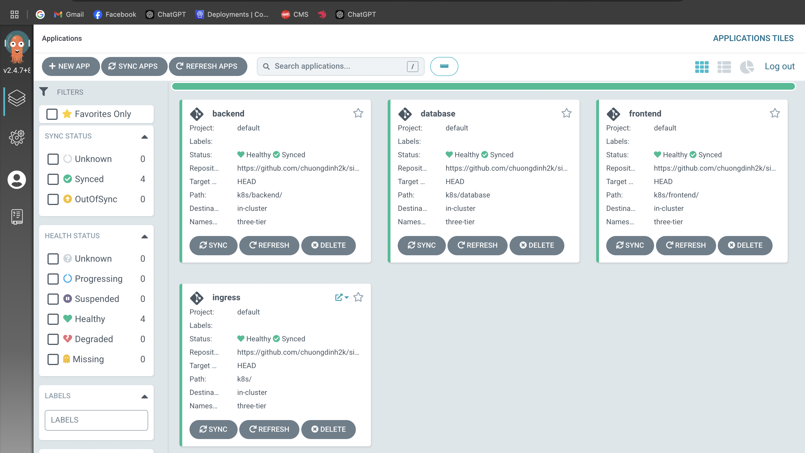

# Design flow

# Deploy three-tier application using AWS ECR, Jenkins and Kubernetes

## Overview

This project is a simple full-stack web application consisting of a backend API and a frontend client. The application is containerized using Docker and deployed on a Kubernetes cluster. Continuous integration and deployment are managed using Jenkins.

## Folder Structure

### `backend/`

This directory contains the backend API code and related files.

- `src/`: Contains the source code for the backend API.
- `tests/`: Contains the test cases for the backend API.
- `Dockerfile`: Dockerfile to build the backend API container image.
- `package.json`: Contains the dependencies and scripts for the backend API.

### `frontend/`

This directory contains the frontend client code and related files.

- `src/`: Contains the source code for the frontend client.
- `public/`: Contains the public assets for the frontend client.
- `Dockerfile`: Dockerfile to build the frontend client container image.
- `package.json`: Contains the dependencies and scripts for the frontend client.

### `k8s/`

This directory contains the Kubernetes manifests for deploying the application.

- `deployment.yaml`: Kubernetes Deployment manifest for deploying the backend and frontend services.
- `service.yaml`: Kubernetes Service manifest for exposing the backend and frontend services.
- `ingress.yaml`: Kubernetes Ingress manifest for routing external traffic to the services.

### Prerequisites

- Docker
- Kubernetes
- kubectl
- eksctl (if using AWS EKS)
- Jenkins (for CI/CD)
- ArgoCD (for managing Kubernetes applications)

## ArgoCD gitOps

